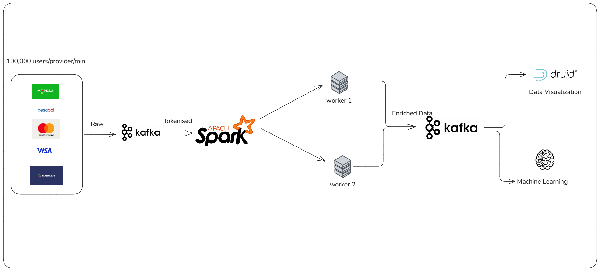

# Real-Time Fraud Detection Engine

## End-to-End Pipeline for Real-Time Transaction Fraud Detection

A production-grade, real-time fraud detection system built on Apache Spark Streaming, Kafka and Redis. This engine processes tokenised payment transactions from multiple providers (VISA, Mastercard, M-Pesa, Flutterwave, Pesapal), enriches them with fraud features and produces enriched events for downstream ML scoring.

---


## Table of Contents

1. [Architecture Overview](#architecture-overview)
2. [Project Structure](#project-structure)
3. [System Components](#system-components)
4. [Data Flow](#data-flow)
5. [Provider Schema Mapping](#provider-schema-mapping)
6. [Feature Engineering](#feature-engineering)
7. [Quick Start](#quick-start)
8. [Configuration](#configuration)
9. [Running the Pipeline](#running-the-pipeline)
10. [Testing](#testing)
11. [Monitoring](#monitoring)
12. [Troubleshooting](#troubleshooting)
13. [API Reference](#api-reference)

---

## Architecture Overview


### Technology Stack

| Layer | Technology |
|-------|-----------|
| **Stream Processing** | Apache Spark 4.0.0 (Structured Streaming) |
| **Messaging** | Apache Kafka 7.7.0 (Confluent) |
| **State Store** | Redis (device fingerprint history) |
| **Data Format** | Apache Avro (schemas) |
| **Monitoring** | Prometheus + Grafana |
| **Containerisation** | Docker + Docker Compose |
| **Language** | Python 3.10/3.11 |

---

## Project Structure

```
Real-Time-Fraud-Detection-Engine-End-To-End-Pipeline/
├── spark/                          # Spark enrichment pipeline
│   ├── enrichment_pipeline.py      # Main streaming pipeline
│   ├── feature_engineer.py         # Feature engineering logic
│   ├── broadcast_joins.py          # Reference data joins (BIN, MCC, FX)
│   ├── redis_state_store.py        # Redis state management
│   ├── schema_normalizer.py        # Schema normalisation
│   └── config/
│       └── spark_config.py         # Pipeline configuration
├── tokeniser/                      # Per-provider tokenisers
│   ├── visa_tokeniser.py
│   ├── mastercard_tokeniser.py
│   ├── mpesa_tokeniser.py
│   ├── flutterwave_tokeniser.py
│   └── pesapal_tokeniser.py
├── kafka/                          # Raw producers
│   ├── visa_raw.py
│   ├── mastercard_raw.py
│   ├── mpesa_raw.py
│   ├── flutterwave_raw.py
│   └── pesapal_raw.py
├── schema/avro/                    # Avro schemas
│   ├── visa_tokenised.avsc
│   ├── mastercard_tokenised.avsc
│   ├── mpesa_tokenised.avsc
│   ├── flutterwave_tokenised.avsc
│   └── pesapal_tokenised.avsc
├── tests/                          # Test suite
│   ├── test_spark_pipeline.py
│   ├── test_*_tokeniser.py
│   ├── test_docker_services.py
│   └── test_data_generated.py
├── monitoring/                     # Observability
│   ├── grafana/
│   └── prometheus/
├── data_generator/                 # Test data generation
│   └── data_generator.py
├── docker-compose.yml              # Infrastructure stack
├── pyproject.toml                  # Project metadata
└── README.md                       # This file
```

---

## System Components

### 1. Tokenisers (Per-Provider)

Each tokeniser consumes from a raw Kafka topic, pseudonymises sensitive data (PAN, MSISDN, email), and produces to a tokenised topic.

| Provider | Raw Topic | Tokenised Topic | Tokenisation Method |
|----------|-----------|-----------------|---------------------|
| **VISA** | `visa_raw` | `visa_tokenised` | Format-Preserving HMAC |
| **Mastercard** | `mastercard_raw` | `mastercard_tokenised` | Format-Preserving HMAC |
| **M-Pesa** | `mpesa_raw` | `mpesa_tokenised` | HMAC-SHA256 Pseudonymisation |
| **Flutterwave** | `flutter_raw` | `flutter_tokenised` | HMAC-SHA256 Pseudonymisation |
| **Pesapal** | `pesapal_raw` | `pesapal_tokenised` | HMAC-SHA256 Pseudonymisation |

### 2. Spark Enrichment Pipeline

The main streaming application that:
- Reads from all 5 tokenised topics simultaneously
- Parses Avro per provider schema
- Unions into a canonical DataFrame
- Applies broadcast joins (BIN, MCC, FX rates)
- Computes 50+ fraud features
- Writes enriched JSON to per-provider output topics

### 3. Feature Engineering

#### Velocity Features (Windowed Aggregations)
- `card_txn_count_1min` / `card_txn_sum_1min`
- `card_txn_count_5min` / `card_amount_sum_5min`
- `card_txn_count_1hr` / `card_amount_avg_1hr` / `card_amount_max_1hr`
- `merchant_txn_count_1hr` / `merchant_amount_sum_1hr`

#### Temporal Features
- `txn_hour`, `txn_day_of_week`, `txn_day_of_month`, `txn_month`
- `is_business_hours` (8am-8pm)
- `is_late_night` (1am-4am) — highest fraud window
- `is_weekend`
- `is_month_end` (last 3 days)

#### Location Features
- `is_international` — card issuer country ≠ transaction currency region
- `is_cross_border_currency` — e.g., KES card used for USD transaction

#### Behavioural Features
- `amount_vs_avg_ratio` — amount vs card's 1hr average
- `is_amount_spike` — ratio > 3.0
- `is_rapid_succession` — > 3 txns in 1 minute
- `is_high_velocity` — > 10 txns in 1 hour
- `is_round_amount` — divisible by 1000
- `is_micro_transaction` — amount < 1.0

#### Network Features
- `is_card_not_present` — CNP detection via POS entry mode
- `is_chip_transaction` — chip-based (lower risk)
- `has_device_fingerprint`

#### Merchant Features
- `is_high_volume_merchant` — > 100 txns/hour
- `prepaid_at_high_risk_mcc` — prepaid card at risky merchant category
- `is_high_value_atm` — ATM withdrawal > $500

#### Composite Risk Score
Lightweight rule-based score (0-100) combining:
- High-risk MCC: +20
- International: +15
- Late night: +10
- Amount spike: +20
- Rapid succession: +25
- Card-not-present: +10
- Cross-border currency: +10
- High velocity: +15
- Prepaid at high-risk MCC: +20
- Micro transaction: +15

---

## Data Flow

### Step 1: Ingestion
Raw transactions are produced to provider-specific Kafka topics.

### Step 2: Tokenisation
Tokenisers consume raw events, apply HMAC-SHA256 pseudonymisation, and produce to tokenised topics. Sensitive fields replaced:
- PAN → `card_token` (format-preserving, retains BIN + last4)
- MSISDN → `msisdn_token`
- Email → `customer_email_token`
- Phone → `customer_phone_token`

### Step 3: Avro Parsing & Union
Spark reads all tokenised topics, parses Avro per provider schema, and unions into a canonical DataFrame with 40+ common columns.

### Step 4: Broadcast Joins
- **BIN table**: Maps BIN to `bin_country`, `bin_prepaid`, `bin_currency`
- **MCC table**: Maps MCC to `is_high_risk_mcc`, `mcc_category`
- **FX table**: Converts amounts to USD for cross-currency comparison
- **Currency region table**: Maps currency to geographic region

### Step 5: Feature Engineering
50+ features computed via Spark SQL transformations and windowed aggregations.

### Step 6: Output
Enriched JSON written to per-provider Kafka topics for downstream ML scoring.

---

## Provider Schema Mapping

### VISA Schema
```json
{
  "transaction_id": "string",
  "source": "string (VISA)",
  "message_type": "string (0100, 0200, etc.)",
  "timestamp": "ISO-8601",
  "event_time_ms": "long (epoch ms)",
  "tokenisation_timestamp": "ISO-8601",
  "card_token": "string (format-preserving)",
  "bin": "string (6 digits)",
  "last4": "string (4 digits)",
  "token_from_cache": "boolean",
  "tokenisation_method": "string",
  "amount": "double",
  "currency_code": "string (numeric ISO)",
  "currency": "string (alpha ISO)",
  "merchant_id": "string",
  "merchant_name": "string",
  "terminal_id": "string",
  "mcc": "string",
  "transaction_type": "string",
  "pos_entry_mode": "string",
  "stan": "string",
  "acquirer_id": "string"
}
```

### Mastercard Schema
Similar to VISA with `source_type: ISO_8583` and additional fields like `forwarder_id`.

### M-Pesa Schema (Daraja Webhook)
```json
{
  "transaction_id": "string",
  "source": "string (MPESA)",
  "source_type": "string (DARAJA_WEBHOOK)",
  "transaction_type": "string (CustomerPayBillOnline, STKPush)",
  "timestamp": "ISO-8601",
  "event_time_ms": "long",
  "tokenisation_timestamp": "ISO-8601",
  "msisdn_token": "string (MPESA_MSISDN_{HASH})",
  "account_token": "string (MPESA_ACC_{HASH})",
  "token_from_cache": "boolean",
  "tokenisation_method": "string",
  "amount": "double (KES)",
  "currency": "string (KES)",
  "bill_ref_number": "string",
  "invoice_number": "string",
  "transaction_receipt": "string",
  "mpesa_receipt_number": "string",
  "first_name": "string",
  "last_name": "string",
  "result_code": "string",
  "result_desc": "string",
  "transaction_role": "string (CUSTOMER/MERCHANT)",
  "third_party_trans_id": "string",
  "merchant_request_id": "string",
  "checkout_request_id": "string"
}
```

### Flutterwave Schema
```json
{
  "transaction_id": "string",
  "source": "string (FLUTTERWAVE)",
  "source_type": "string (WEBHOOK)",
  "event": "string (charge.completed)",
  "tx_ref": "string",
  "flw_ref": "string",
  "timestamp": "ISO-8601",
  "event_time_ms": "long",
  "tokenisation_timestamp": "ISO-8601",
  "card_token": "string (FLW_{BIN}_TOKEN_{HASH}_{LAST4})",
  "customer_token": "string",
  "ref_token": "string",
  "token_from_cache": "boolean",
  "tokenisation_method": "string",
  "amount": "double",
  "currency": "string",
  "status": "string (successful/pending/failed)",
  "payment_type": "string (card/mpesa/banktransfer)",
  "charge_type": "string",
  "bin": "string",
  "last4": "string",
  "device_fingerprint": "string (MD5)",
  "auth_model": "string (PIN/NOAUTH/VBV/OTP)",
  "processor_response": "string",
  "customer_email_hash": "string (MD5 first 16 chars)"
}
```

### Pesapal Schema
```json
{
  "transaction_id": "string",
  "source": "string (PESAPAL)",
  "source_type": "string (IPN_CALLBACK)",
  "merchant_reference_token": "string (PESAPAL_MERCHANT_{HASH})",
  "tracking_id": "string",
  "payment_status": "string (COMPLETED/PENDING/FAILED)",
  "payment_method": "string (VISA/MASTERCARD/MPESA/AIRTEL_MONEY)",
  "timestamp": "ISO-8601",
  "event_time_ms": "long",
  "tokenisation_timestamp": "ISO-8601",
  "customer_email_token": "string (PESAPAL_EMAIL_{HASH})",
  "customer_phone_token": "string (PESAPAL_PHONE_{HASH})",
  "payment_account_token": "string (PESAPAL_ACC_{HASH})",
  "token_from_cache": "boolean",
  "tokenisation_method": "string",
  "amount": "double",
  "currency": "string (KES/USD/UGX/TZS)",
  "confirmation_code": "string",
  "description": "string",
  "customer_first_name": "string",
  "customer_last_name": "string",
  "pesapal_notification_type": "string",
  "pesapal_payment_id": "string",
  "error_code": "string",
  "error_message": "string"
}
```

---

## Quick Start

### Prerequisites

- Docker & Docker Compose
- Python 3.10+ (for local development)
- PowerShell (Windows) or Bash (Linux/Mac)

### 1. Clone & Setup

```bash
git clone <repo-url>
cd Real-Time-Fraud-Detection-Engine-End-To-End-Pipeline
python -m venv .venv
.venv\Scripts\Activate.ps1  # Windows
# source .venv/bin/activate    # Linux/Mac
pip install -e ".[dev]"
```

### 2. Start Infrastructure

```bash
docker compose up -d
```

This starts:
- Kafka + Zookeeper
- Spark Master + 2 Workers
- Redis
- PostgreSQL
- Prometheus + Grafana
- Kafdrop (Kafka UI)

### 3. Create Kafka Topics

```bash
# Input topics (raw)
docker exec -it kafka kafka-topics --bootstrap-server localhost:9092 --create --topic visa_raw --partitions 1 --replication-factor 1 --if-not-exists
docker exec -it kafka kafka-topics --bootstrap-server localhost:9092 --create --topic mastercard_raw --partitions 1 --replication-factor 1 --if-not-exists
docker exec -it kafka kafka-topics --bootstrap-server localhost:9092 --create --topic mpesa_raw --partitions 1 --replication-factor 1 --if-not-exists
docker exec -it kafka kafka-topics --bootstrap-server localhost:9092 --create --topic flutter_raw --partitions 1 --replication-factor 1 --if-not-exists
docker exec -it kafka kafka-topics --bootstrap-server localhost:9092 --create --topic pesapal_raw --partitions 1 --replication-factor 1 --if-not-exists

# Tokenised topics
docker exec -it kafka kafka-topics --bootstrap-server localhost:9092 --create --topic visa_tokenised --partitions 1 --replication-factor 1 --if-not-exists
docker exec -it kafka kafka-topics --bootstrap-server localhost:9092 --create --topic mastercard_tokenised --partitions 1 --replication-factor 1 --if-not-exists
docker exec -it kafka kafka-topics --bootstrap-server localhost:9092 --create --topic mpesa_tokenised --partitions 1 --replication-factor 1 --if-not-exists
docker exec -it kafka kafka-topics --bootstrap-server localhost:9092 --create --topic flutter_tokenised --partitions 1 --replication-factor 1 --if-not-exists
docker exec -it kafka kafka-topics --bootstrap-server localhost:9092 --create --topic pesapal_tokenised --partitions 1 --replication-factor 1 --if-not-exists

# Output (enriched) topics
docker exec -it kafka kafka-topics --bootstrap-server localhost:9092 --create --topic visa_enriched --partitions 1 --replication-factor 1 --if-not-exists
docker exec -it kafka kafka-topics --bootstrap-server localhost:9092 --create --topic mastercard_enriched --partitions 1 --replication-factor 1 --if-not-exists
docker exec -it kafka kafka-topics --bootstrap-server localhost:9092 --create --topic mpesa_enriched --partitions 1 --replication-factor 1 --if-not-exists
docker exec -it kafka kafka-topics --bootstrap-server localhost:9092 --create --topic flutterwave_enriched --partitions 1 --replication-factor 1 --if-not-exists
docker exec -it kafka kafka-topics --bootstrap-server localhost:9092 --create --topic pesapal_enriched --partitions 1 --replication-factor 1 --if-not-exists
```

### 4. Install Dependencies on Spark Containers

```bash
docker exec -it -u root spark-master pip install redis
docker exec -it -u root spark-worker pip install redis
docker exec -it -u root spark-worker-2 pip install redis
```

### 5. Run the Pipeline

```bash
docker exec -it spark-master /opt/spark/bin/spark-submit \
  --master spark://spark-master:7077 \
  --conf spark.jars.ivy=/tmp/.ivy2 \
  --conf spark.executorEnv.PYTHONPATH=/opt/project/spark \
  --packages org.apache.spark:spark-sql-kafka-0-10_2.13:4.0.0,org.apache.spark:spark-avro_2.13:4.0.0 \
  /opt/project/spark/enrichment_pipeline.py
```

### 6. Verify

- Spark UI: http://127.0.0.1:9090
- Kafdrop (Kafka UI): http://127.0.0.1:9000
- Grafana: http://127.0.0.1:3000

---

## Configuration

### SparkConfig (`spark/config/spark_config.py`)

Key configuration parameters:

| Parameter | Default | Description |
|-----------|---------|-------------|
| `APP_NAME` | `FraudEnrichmentPipeline` | Spark application name |
| `KAFKA_BOOTSTRAP_SERVERS` | `kafka:29092` | Kafka broker (internal Docker network) |
| `INPUT_TOPICS` | `{VISA: visa_tokenised, ...}` | Source topics per provider |
| `OUTPUT_TOPICS` | `{VISA: visa_enriched, ...}` | Destination topics per provider |
| `CHECKPOINT_BASE` | `/tmp/checkpoint` | Spark checkpoint directory |
| `WATERMARK_DELAY` | `10 minutes` | Late event tolerance |
| `TRIGGER_INTERVAL` | `1 second` | Micro-batch trigger interval |
| `HIGH_RISK_THRESHOLD` | `2000.0` | High-value transaction threshold (USD) |
| `MAX_OFFSETS_PER_TRIGGER` | `10000` | Max Kafka offsets per micro-batch |
| `STARTING_OFFSETS` | `latest` | Kafka offset strategy |
| `REDIS_HOST` | `redis` | Redis hostname |
| `REDIS_PORT` | `6379` | Redis port |
| `DLQ_TOPIC` | `enrichment_dlq` | Dead letter queue topic |

### Environment Variables

Override defaults via environment variables:

```bash
export KAFKA_BOOTSTRAP_SERVERS=kafka:29092
export WATERMARK_DELAY="5 minutes"
export TRIGGER_INTERVAL="5 seconds"
export HIGH_RISK_THRESHOLD=5000.0
export REDIS_HOST=redis
export REDIS_PORT=6379
export REDIS_PASSWORD=secret
export CHECKPOINT_BASE=/tmp/checkpoint
```

---

## Running the Pipeline

### Local Development (Direct Python)

```bash
python -m spark.enrichment_pipeline
```

### Docker (Recommended for Production)

```bash
# Build and start all services
docker compose up -d

# Run the enrichment pipeline
docker exec -it spark-master /opt/spark/bin/spark-submit \
  --master spark://spark-master:7077 \
  --conf spark.executorEnv.PYTHONPATH=/opt/project/spark \
  --packages org.apache.spark:spark-sql-kafka-0-10_2.13:4.0.0,org.apache.spark:spark-avro_2.13:4.0.0 \
  /opt/project/spark/enrichment_pipeline.py
```

### Production Deployment

For production, consider:
- Kubernetes with Spark Operator
- Dedicated Kafka cluster (MSK, Confluent Cloud)
- Redis Cluster for HA
- Schema Registry for Avro evolution
- Separate checkpoint storage (S3, HDFS)

---

## Testing

### Run All Tests

```bash
pytest tests/ -v
```

### Run Unit Tests Only (Exclude Integration)

```bash
pytest tests/ -v -k "not integration and not docker and not kafka"
```

### Run Specific Test Suite

```bash
pytest tests/test_spark_pipeline.py -v
pytest tests/test_flutterwave_tokeniser.py -v
```

### Test Coverage

| Component | Tests | Status |
|-----------|-------|--------|
| Spark Pipeline | 100+ | ✅ Passing |
| Tokenisers | 50+ | ✅ Passing |
| Feature Engineering | 30+ | ✅ Passing |
| Docker Services | 5 | ⚠️ Needs local Kafka |

### Integration Tests

Integration tests require the full Docker stack:
```bash
docker compose up -d
pytest tests/ -v -k "integration"
```

---

## Monitoring

### Prometheus Metrics

The pipeline exposes Spark Streaming metrics via Prometheus:
- Input rate (records/sec)
- Processing latency (ms)
- Output rate (records/sec)
- Batch duration (ms)
- Kafka lag (offsets behind)

### Grafana Dashboards

Pre-configured dashboards in `monitoring/grafana/dashboards/`:
- **Kafka Dashboard**: Topic throughput, consumer lag, broker health
- **Spark Dashboard**: Job duration, executor memory, task distribution
- **Postgres Dashboard**: Connection pool, query performance

### Alerting

Prometheus alert rules in `monitoring/prometheus/rules/`:
- Kafka consumer lag > 1000
- Spark batch duration > 30 seconds
- Container memory usage > 80%

---

## Troubleshooting

### Common Issues

#### 1. `ModuleNotFoundError: No module named 'redis'`

**Fix**: Install redis on all Spark containers:
```bash
docker exec -it -u root spark-master pip install redis
docker exec -it -u root spark-worker pip install redis
docker exec -it -u root spark-worker-2 pip install redis
```


Check Spark UI for detailed execution plans:
- http://127.0.0.1:9090 (Spark Master)
- http://127.0.0.1:8080 (Spark Application)

---

## API Reference

### `FraudEnrichmentPipeline`

Main class orchestrating the enrichment pipeline.

#### Methods

| Method | Description |
|--------|-------------|
| `create_spark_session()` | Creates SparkSession with Kafka/Avro config |
| `read_from_kafka()` | Reads from all input topics, parses Avro |
| `apply_enrichment(df)` | Applies all enrichment steps |
| `write_to_kafka(df)` | Writes enriched batches to output topics |
| `run()` | Main execution loop |

### `FeatureEngineer`

Computes fraud features from normalised transactions.

#### Methods

| Method | Features |
|--------|----------|
| `compute_velocity_features(df)` | Counts/sums over 1min, 5min, 1hr windows |
| `compute_temporal_features(df)` | Hour, day, weekend, month-end flags |
| `compute_location_features(df)` | International, cross-border detection |
| `compute_behavioral_features(df)` | Amount deviation, velocity patterns |
| `compute_network_features(df)` | CNP, chip, device fingerprint |
| `compute_merchant_features(df)` | High-volume, high-risk MCC combinations |
| `compute_composite_risk_score(df)` | Rule-based 0-100 risk score |

### `BroadcastJoinManager`

Manages broadcast joins for reference data.

#### Methods

| Method | Description |
|--------|-------------|
| `initialize(spark, redis_client)` | Loads BIN, MCC, FX, currency tables |
| `apply_all_joins(df)` | Applies all broadcast joins to DataFrame |

---

## Contributing

1. Fork the repository
2. Create a feature branch (`git checkout -b feature/amazing-feature`)
3. Commit changes (`git commit -m 'Add amazing feature'`)
4. Push to branch (`git push origin feature/amazing-feature`)
5. Open a Pull Request

### Code Style

- Python: PEP 8, Black formatter
- Commits: Conventional Commits (`feat:`, `fix:`, `docs:`, `test:`)
- Tests: pytest, 80%+ coverage

---

